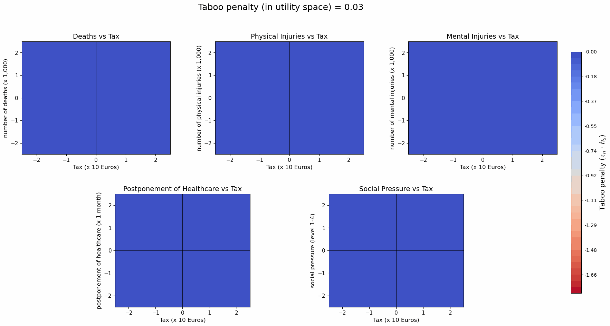

# Breaking the Taboo in Taboo Trade-Offs: A Multimodal, Multitask Framework for Discrete Choice Modelling
<p align="center">
  <a href="https://dx.doi.org/10.2139/ssrn.7276298">
    
  </a>
</p>

Our paper introduces the **taboo trade-off aversion neural network (TTOA-NN)**, a multimodal and multitask framework for discrete choice models that identifies taboo trade-offs and individual-specific taboo aversion directly from stated choices and text data.


## Abstract

Healthcare policy often involves morally problematic trade-offs, such as lives for money or quality of life for efficiency. We introduce the taboo trade-off aversion neural network (TTOA-NN), a multimodal and multitask framework that learns taboo trade-offs and individual aversion from stated choices and textual justifications. Simulation experiments establish its identifiability, and an application to a Dutch pandemic preparedness experiment shows that taboo trade-off aversion is primarily associated with the moral foundation Authority rather than Care, Fairness, or Sanctity. The modular framework embeds into any random utility maximization model and reveals which trade-offs are taboo, who is most averse to them, and how this aversion relates to moral orientations expressed in people’s choice justifications.

## Taboo penalty in utility space

The animation shows how the learned taboo penalty changes as individual taboo aversion increases. Stronger red indicates a larger taboo penalty in utility space. This finding is obtained from a trained TTOA-NN model based on the empirical application in our paper.



## Instructions

### Requirements

The TTOA-NN supports Python 3.9, 3.10, 3.11, and 3.12. The supported package versions and Python constraint are defined in [`pyproject.toml`](pyproject.toml).

Create a virtual environment, activate it, and install the package together with the notebook dependencies:

```bash
python3.11 -m venv .venv
source .venv/bin/activate
python -m pip install --upgrade pip
python -m pip install -e '.[notebook]'
```

Python 3.9, 3.10, or 3.12 can be used instead of Python 3.11. The same runtime dependencies are also listed in [`requirements.txt`](requirements.txt):

```bash
python -m pip install -r requirements.txt
```

For platform-specific PyTorch installation instructions, see [the official PyTorch installation guide](https://pytorch.org/get-started/locally/).

### Examples

- [`train_example.ipynb`](train_example.ipynb) demonstrates how to load the data, configure a TTOA-NN model, train it with early stopping, and evaluate its validation performance.
- [`evaluation_example.ipynb`](evaluation_example.ipynb) demonstrates post-analysis of a trained model, including choice metrics, moral stance metrics, taboo signal heatmaps, and quartile-based taboo penalty heatmaps.

The empirical data and trained checkpoints are not included in this repository. Before running either notebook, set the data and checkpoint paths in its configuration cell to files available on your local device.

### Simulation data

Simulation data will be added in a future update. The repository structure will be extended with instructions for reproducing the simulation experiments when those files are available.

## Citation

```bibtex
@article{smeele2026ttoann,
  author  = {Smeele, Nicholas VR and de Bekker-Grob, Esther W and van Cranenburgh, Sander},
  title   = {Breaking the Taboo in Taboo Trade-Offs: A Multimodal, Multitask Framework for Discrete Choice Modelling},
  year    = {2026},
  note    = {Available at SSRN: https://ssrn.com/abstract=7276298},
  doi     = {10.2139/ssrn.7276298}
}
```
